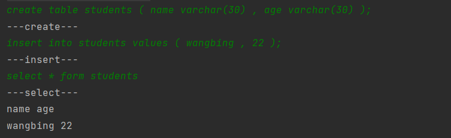

**本项目旨在练习实现一个基于Java语言的简易关系型数据库**， 用来学习关系型数据库(如Mysql)的设计理念、核心骨架、基本算法。

涉及的核心原理

自平衡的排序二叉树: 我们的数据库采用平衡二叉树,来加快增删改查的速度

序列化:因为要存储到磁盘空间上,对添加数据之后的二叉树进行序列化


StartUpMain这个是启动类要,要启动的化

### 设计思路
#### 1.建表

```sql
create table students ( name varchar(30) , age varchar(30) );
```
建表的逻辑:建立一个Entity类

定义一个int id,作为查询的主键,定义一个map类型存放各个属性,定义一个String的Table.

我们的数据库是一个比较简单的数据库,所有的存放类都是Entity的实例

建立一个自平衡的二叉树,存储数据

在这个过程当中我们需要一个在表中维护一个id,随着子数据的被插入而增加.这就是我们自增的主键
之后我们通过截取字符串的方法获取到了表在所有的列和属性,在这里我们的属性可以用java中的Object来代替通过int propertyNum = (s.length - 4) / 3;我们来算出有多少个属性,在这里画一个饼,以后会通过分析字符串来识别
之后遍历字符串,在表中有一个list维护了属性

#### 2.插入数据
```sql
insert into students values ( wangbing , 22 );
```
这个是直接在平衡二叉树里面封装了一个add方法,这个添加的子结点会根据id进行自平衡,保持二叉树平衡,以此来提升查找效率

#### 3.查找数据
```sql
select * form students ;
```
这个在平衡二叉树里面写了一个中序遍历的方法,来打印.

最后这是运行截图


GitHub:https://github.com/xiaozhaotongzhide/MyMiniSql

### 未来改进(画饼)
1.完成删除和条件查询
2.对属性进行改进,使其可以存放多种属性.
3.设计一个工厂类,让工厂类来建立数据结点,同时把表中存放的自增长id给工厂类来进行解耦
4.通过java序列化来实现本地存储